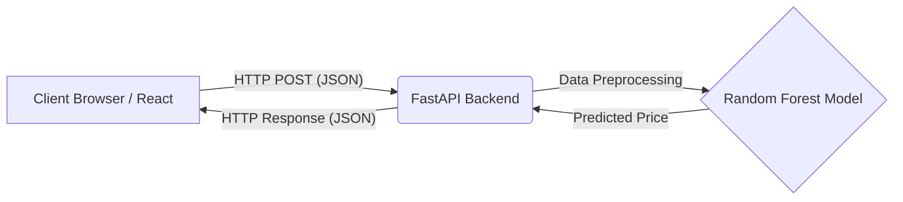
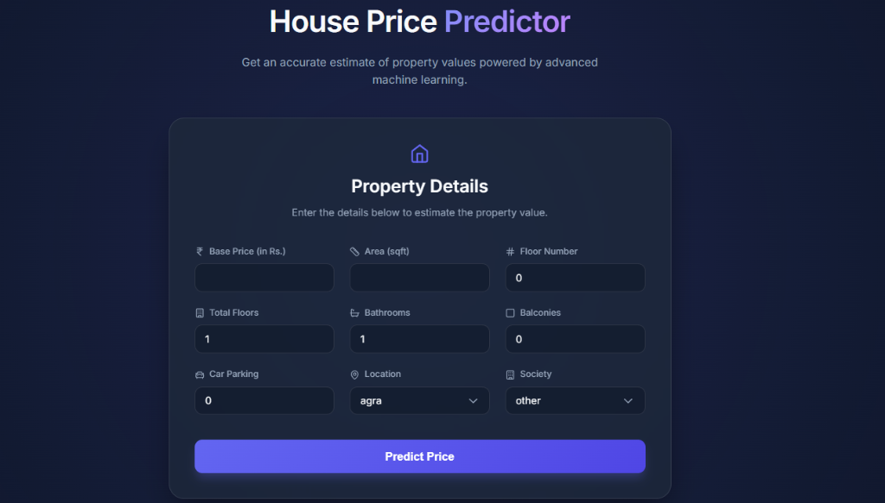
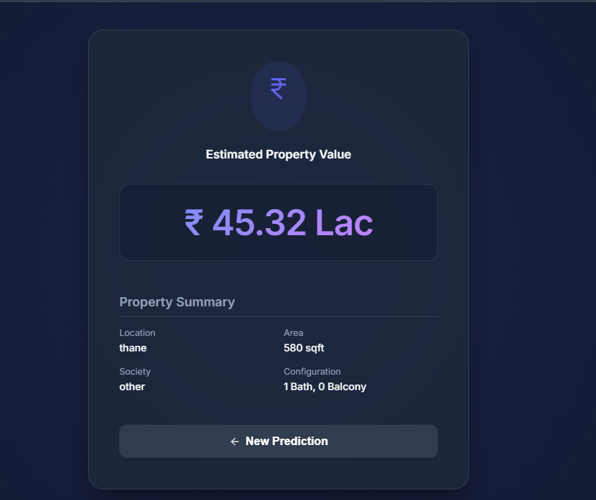

# House Price Predictor 🏠

## 📖 Overview
The House Price Predictor is a full-stack web application that leverages a Machine Learning model (Random Forest Regressor) to predict property values based on various features such as area, floor number, bathrooms, and location. It provides a beautiful, user-friendly interface for inputting house details and instantly seeing the predicted market price.

## 📐 Architecture Diagram


## 💻 Tech Stack
* **Frontend**: React, Vite, TypeScript, Lucide Icons (Vanilla CSS for styling)
* **Backend**: Python, FastAPI, Uvicorn, Pydantic
* **Machine Learning**: Scikit-Learn (Random Forest Regressor), Pandas, Joblib

## 📁 Project Structure
```
house-price-app/
├── backend/
│   ├── app/
│   │   ├── api/routes/      # FastAPI endpoint routes
│   │   ├── schemas/         # Pydantic validation models
│   │   └── services/        # ML prediction & preprocessing logic
│   ├── models/              # Saved model (.pkl) & JSON encodings
│   ├── tests/               # Backend API tests
│   └── requirements.txt     # Python dependencies
├── frontend/
│   ├── src/                 # React components and TS types
│   ├── package.json         # Node dependencies
│   └── vite.config.ts       # Vite configuration
└── notebooks/               # Jupyter notebook used for training the model
```

## 📊 Dataset & Download Instructions
The model was trained on a custom Indian house prices dataset.
* **Dataset Link**: [Provide a link to your dataset, e.g., Kaggle link here]
* **How to Download**: 
  1. Click the link above to access the dataset.
  2. Click the "Download" button to get the `.csv` file.
  3. Place the downloaded `.csv` file into the `notebooks/data/` folder.
  4. *(Note: The dataset is not included in this repository due to its large size).*

## 🚀 Setup Instructions

### 1. Generate the Machine Learning Model
Because the trained Random Forest model is over 200MB, it is not included in this repository. You must generate it yourself:
1. Ensure you have downloaded the dataset into the `notebooks/data/` folder.
2. Open the `notebooks/house_price_model.ipynb` file in Jupyter Notebook, VS Code, or Google Colab.
3. Run all cells in the notebook.
4. This will generate a `house_price_model.pkl` file in the notebooks folder. The backend is smart enough to automatically find it there!

### 2. Backend Setup
```bash
cd backend
python -m venv .venv
# Activate virtual environment (Windows)
.venv\Scripts\activate
# Activate virtual environment (Mac/Linux)
source .venv/bin/activate

pip install -r requirements.txt
uvicorn app.main:app --reload
```

### 2. Frontend Setup
```bash
cd frontend
npm install
npm run dev
```

## ⚙️ Environment Variables

### Frontend (`frontend/.env`)
| Variable | Description | Default Value |
|----------|-------------|---------------|
| `VITE_API_BASE_URL` | The URL where the FastAPI backend is running | `http://localhost:8000` |

### Backend
*(No environment variables are required for the backend to run in its default state).*

## 🔌 API Reference

### `POST /api/v1/predict`
Predicts the price of a house based on its features.

**Example cURL Request:**
```bash
curl -X POST "http://localhost:8000/api/v1/predict" \
     -H "Content-Type: application/json" \
     -d '{
           "price_in_rupees": 13799,
           "area_sqft": 473,
           "floor_num": 3,
           "bathroom": 2,
           "balcony": 0,
           "car_parking": 1,
           "location": "thane",
           "society": "other",
           "total_floors": 22
         }'
```

**Example Response:**
```json
{
  "predicted_price": 9716000.0
}
```

## 📈 Model Metrics
The chosen model for this project is a **Random Forest Regressor**, which outperformed other models (like K-Nearest Neighbors) during evaluation.
* **Mean Absolute Error (MAE):** 348,031
* **Root Mean Squared Error (RMSE):** 1,077
* **R-squared ($R^2$):** 0.9914

## 📸 Screenshots

### Empty Form


### Filled Form


### Prediction Result

